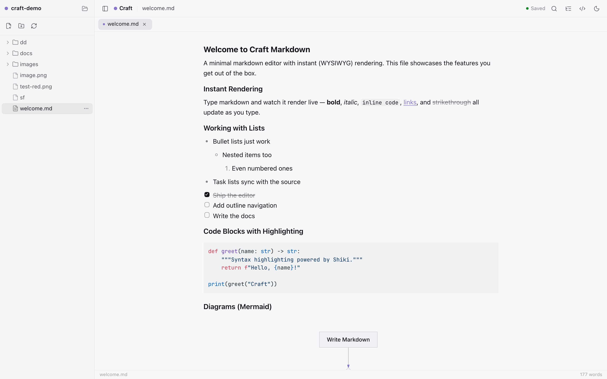
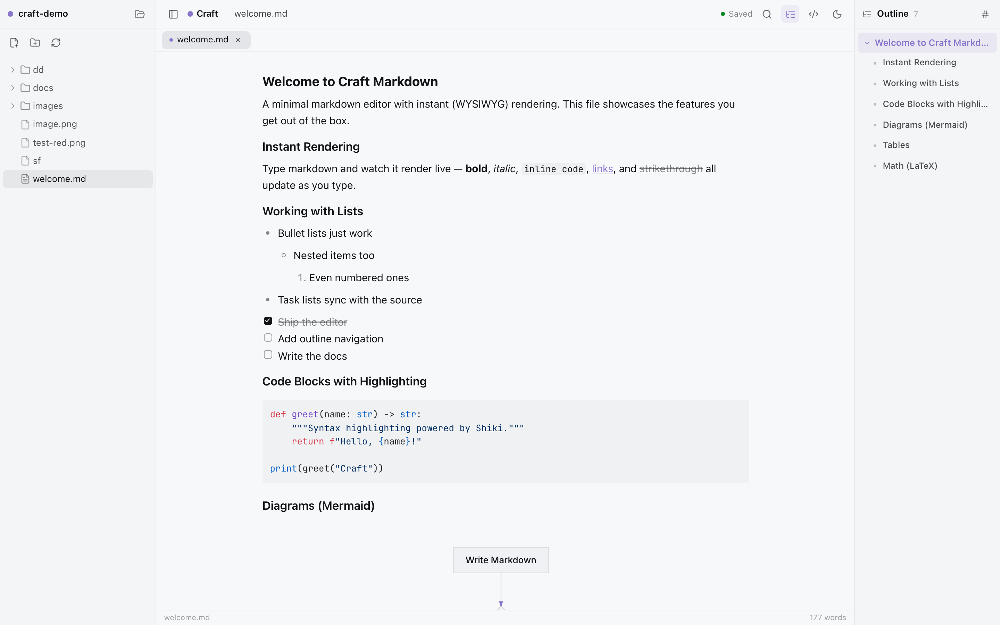
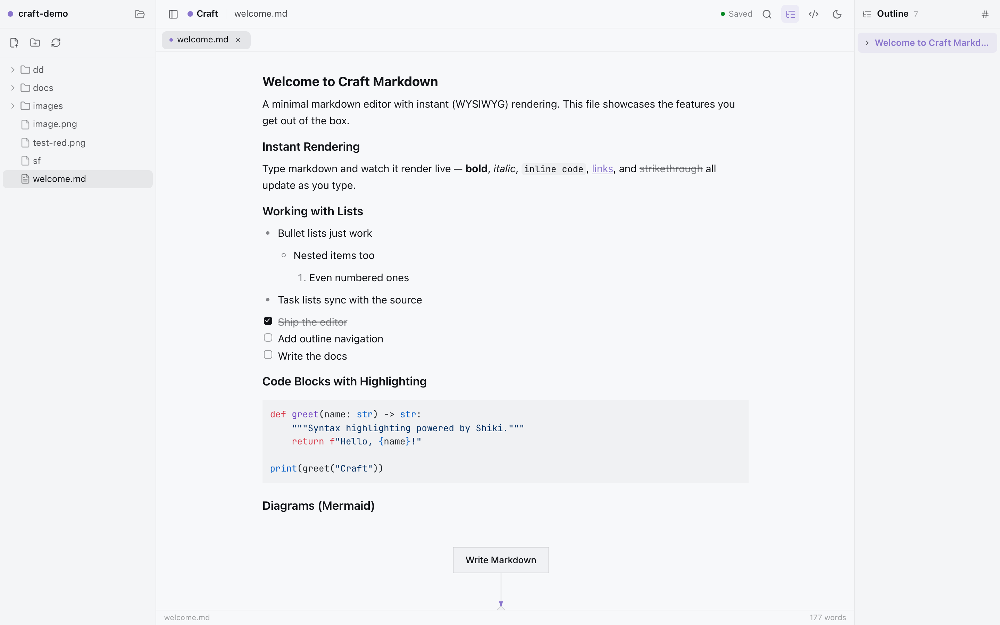
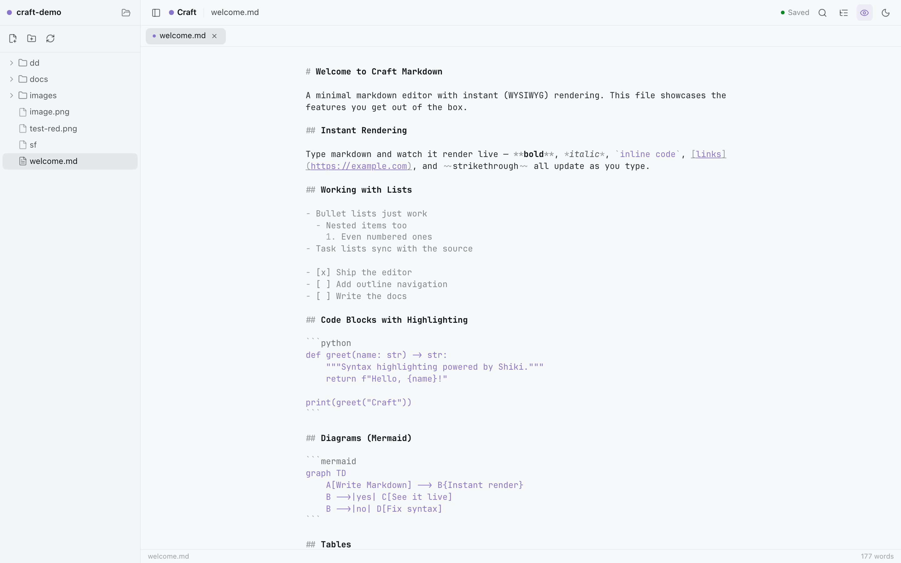
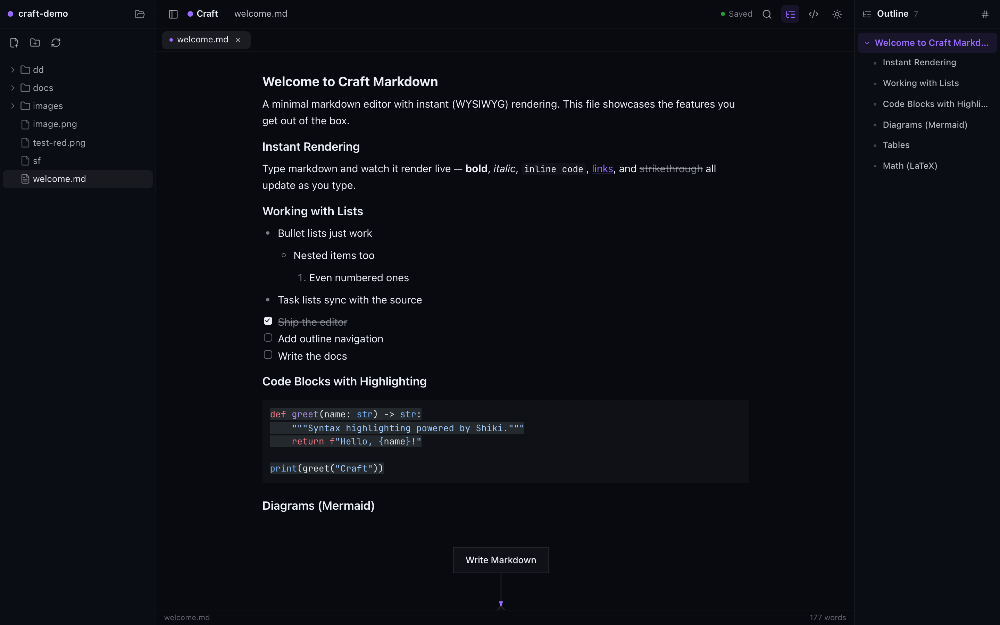

# Craft Markdown

一个极简、纯粹的 Markdown 编辑器，所见即所得（WYSIWYG）即时渲染。基于开源 [craft-agents-oss](https://github.com/craft-ai-agents/craft-agents-oss)（Apache 2.0）精简而成——去掉了所有与编辑无关的部分（无 Agent、无聊天、无服务端），只留下文件树 + 实时渲染编辑器。

> Fork of [Craft Agents](https://github.com/craft-ai-agents/craft-agents-oss)，编辑相关组件来自原仓库并做了大量修改。

## 特性

- **文件树侧栏** — 打开一个文件夹作为工作区，支持创建 / 重命名 / 删除 / 拖拽排序文件与文件夹
- **即时渲染编辑器**（TipTap）— 标题、列表、任务清单、语法高亮代码块、LaTeX 数学公式、Mermaid 图表、表格，边写边渲染
- **大纲导航（TOC）** — 右侧可折叠的树状标题侧栏：层级结构一目了然，点击标题平滑跳转 + 闪烁定位，滚动时自动高亮当前章节
- **双视图** — 所见即所得 / 源码（CodeMirror，语法高亮）一键切换，大纲在两种模式下都可跳转定位
- **自动保存** — 防抖自动保存 + `Cmd/Ctrl+S`，保存状态指示器
- **明暗主题** — 一键切换，全界面适配

## 截图

**编辑器 + 树状大纲**



**大纲侧栏（展开的树结构）**



**大纲侧栏（折叠子树）**



**源码模式（Markdown 高亮）**



**暗色主题**



## 快速开始

需要 [Bun](https://bun.sh)。

```bash
bun install          # 在 apps/editor 目录内
bun run dev          # 文件服务器 (8787) + Vite 开发服务器 (5173)
```

然后打开 http://localhost:5173 ，输入一个文件夹路径作为工作区。

生产模式：

```bash
bun start            # 构建并运行于 http://localhost:8787
```

## macOS 桌面版

内置 macOS 应用（Electron），文件服务器嵌在应用进程内，无需 Bun 即可独立运行：

```bash
bun run app:start   # 构建 + 启动应用
bun run app:dist    # 构建 + 打包 .dmg / .zip 到 apps/desktop/dist
```

打包后的应用安装为 **"Craft Markdown"**，避免与官方 Craft 应用冲突。

## 目录结构

```
apps/editor/          Vite + React 应用（编辑器 UI）
  src/editor/         从 @craft-agent/ui 复用的编辑器组件（markdown 子图）
  src/components/     文件树、大纲、应用外壳
server/index.ts       Bun 文件服务器：静态资源 + 工作区文件 API
```

## 技术栈

Vite · React 18 · TipTap 3 · CodeMirror 6 · Shiki · Mermaid · KaTeX · Tailwind CSS 4 · Bun

## 许可证

本项目基于 [Apache License 2.0](LICENSE)，是 [Craft Agents](https://github.com/craft-ai-agents/craft-agents-oss)（Apache 2.0，Copyright 2026 Craft Docs Ltd.）的派生作品，详见 [NOTICE](NOTICE)。

"Craft" 和 "Craft Agents" 是 Craft Docs Ltd. 的商标。本项目与 Craft Docs Ltd. 无隶属或背书关系。
